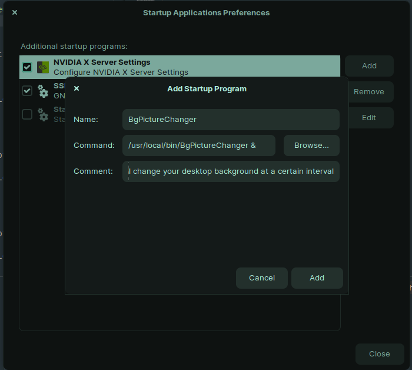

# BgPictureChanger

> This is meant to be run in linux, Gnome based DE's only

Something you don't need and certainly I could have find something that existed already

This is a small console program that changes your gnome desktop background every certain amount of time

## Prerequisites
dotnet core 3.1+
Powershell Core (optional for instalation)*

## Install
- chmode +x ./deploy-linux.ps1*
- ./deploy-linux.ps1*
- or manually
    > ```
    > dotnet publish -r linux-x64 --self-contained true /p:PublishReadyToRun=true /p:PublishSingleFile=true -o dist
    > sudo cp ./dist/BgPictureChanger /usr/local/bin
    > ```

or if you have dotnet already installed just do 

- `dotnet tool install --global BgPictureChanger --version 0.1.0`
***Note***: the comand for the dotnet tool is `bgpictureChanger`

## Quick Test
after installing simply try
```
BgPictureChanger # or BgPictureChanger & # to release terminal
```


## Make it run at the start of your session

Open Startup programs in your distro settings and 


## Configuration
you can configure the following settings
- refresh lapse
- picture folder
- log path

### CLI arguments
you can use one of the follwing at a time [s, m, h, d, w] seconds, minutes, hours, days, weeks
```
BgPictureChanger "--refresh=2h" 
# the following is wrong, use a single unit, 2h or 30m or 5d but not more than one
BgPictureChanger "--refresh=2h3m"
BgPictureChanger "--pictures=/path/to/directory/with/pictures/with/permissions/to/read"
BgPictureChanger "--logpath=/path/to/file/with/permissions/to/write/"
# all together
BgPictureChanger "--logpath=./changer.log" "--pictures=./my-pictures" "--refresh=20m"
```

### Environment Variables
you can customize these env variables and it should pick'em up just like the CLI options
- `BgPictureChanger_REFRESH_RATE=2h`
- `BgPictureChanger_Pictures_PATH="$HOME/Pictures"`


### Defaults
- if refresh is not supplied it will default to `1h` or if there are errors parsing it, it will default to `30s` or `30m` or `1h` or `1d` or `1w` depending on the selected time unit
- if pictures path is not supplied or not found, it will fallback to `$HOME/Pictures`
- if logpath is not specified it will default to `$HOME/.config/.changebg.log`
